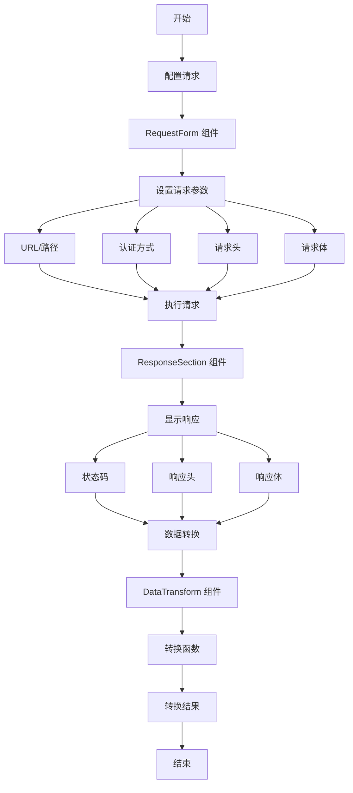

# API 请求构建器

一个用于构建和测试 API 请求的 Vue 3 组件，具有美观的用户界面。

# Start of Selection
[English Documentation](README.md)

## 工作流程



## 安装

```bash
npm install vue-api-request-builder
# 或
yarn add vue-api-request-builder
# 或
pnpm add vue-api-request-builder
```

## 使用方法

### 基础用法

```vue
<template>
  <div class="app-container">
    <RequestForm v-model="requestSchema" @update:modelValue="handleSchemaChange" />
    <ResponseSection v-model="requestSchema" />
  </div>
</template>

<script setup lang="ts">
import { ref } from 'vue';
import { RequestForm, ResponseSection, type RequestSchema, defaultRequestSchema } from 'vue-api-request-builder';

const requestSchema = ref<RequestSchema>(defaultRequestSchema);

const handleSchemaChange = (newSchema: RequestSchema) => {
  console.log("Schema changed:", newSchema);
};
</script>
```

## 组件

### RequestForm

用于构建 API 请求的主要组件。它提供了一个表单界面来配置：

#### 属性
- `modelValue` (RequestSchema): 请求模式对象 (v-model)

#### 事件
- `update:modelValue`: 当模式发生变化时触发

#### 功能
- HTTP 方法选择 (GET, POST, PUT, DELETE, OPTIONS)
- URL 配置（基础 URL 和路径）
- URL 参数管理
- 认证选项：
  - 无认证
  - Basic 认证
  - Bearer Token 认证
- 自定义请求头
- 请求体支持：
  - JSON
  - Form Data
  - 原始文本
- 请求 URL 和请求体的实时预览

### ResponseSection

显示 API 请求的响应结果。

#### 属性
- `modelValue` (RequestSchema): 请求模式对象 (v-model)

#### 功能
- 请求方法选择 (XMLHttpRequest/Fetch)
- 响应显示：
  - 状态码（带颜色标识）
  - 响应时间
  - 响应头
  - 响应体（带格式化）
- 错误处理和显示

### DataTransform

用于配置和执行数据转换函数的组件。

#### 属性
- `modelValue` (string): 转换函数字符串 (v-model)

#### 功能
- 提供代码编辑器界面
- 支持 JavaScript 函数编写
- 实时语法检查
- 函数执行结果预览

### KeyValueInput

用于管理键值对的可复用组件。

#### 属性
- `modelValue` (KeyValuePair[]): 键值对数组 (v-model)
- `addButtonText` (string): 添加按钮的文本
- `showPreview` (boolean): 是否显示预览
- `previewText` (string): 预览中显示的文本

#### 事件
- `update:modelValue`: 当键值对发生变化时触发

## 类型定义

### RequestSchema

```typescript
interface RequestSchema {
  method: 'GET' | 'POST' | 'PUT' | 'DELETE' | 'OPTIONS';
  url: string;
  path: string;
  auth: AuthConfig;
  params: KeyValuePair[];
  headers: KeyValuePair[];
  body: RequestBody;
}
```

### AuthConfig

```typescript
interface AuthConfig {
  type: 'none' | 'Basic' | 'Bearer';
  username?: string;
  password?: string;
  token?: string;
}
```

### RequestBody

```typescript
interface RequestBody {
  type: 'application/json' | 'multipart/form-data' | 'text/plain';
  json?: string;
  formData?: KeyValuePair[];
  raw?: string;
}
```

### ResponseData

```typescript
interface ResponseData {
  status: string;
  headers: Record<string, string>;
  body: string;
  timing?: number;
}
```

## 工具函数

### executeRequest

```typescript
function executeRequest(
  schema: RequestSchema,
  method: 'fetch' | 'xhr' = 'xhr'
): Promise<ResponseData>
```

使用 Fetch API 或 XMLHttpRequest 执行 API 请求。

### executeTransformFunction

```typescript
function executeTransformFunction(
  transformFunctionString: string,
  data: any
): any
```

执行数据转换函数，将输入数据转换为所需的格式。

## 依赖项

本包需要：
- Vue 3.x
- Ant Design Vue 4.x

## 许可证

MIT 